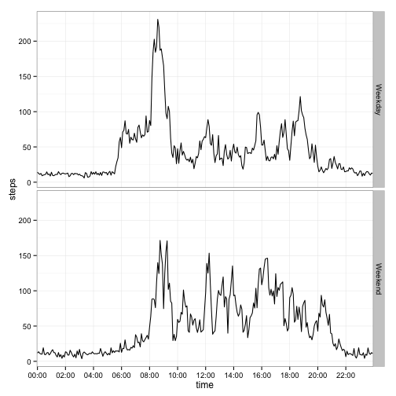

##Reproducible Research Assignment 1
                        
We first begin by loading the necessary packages for the code to work:


```r
require(ggplot2)
require(lubridate)
require(Amelia)
```

The ggplot2 package is used for graphing, lubridate for converting dates to
POSIX and Amelia for multiple imputation to give values to NA data.


We then begin the assignment proper by downloading the file containing the data:


```r
read.dataset <- function() {
        zip.filename <- "./repdata-data-activity.zip"
        txt.filename <- "./activity.csv"
        if (!file.exists(txt.filename)) {
                if (!file.exists(zip.filename)) {
                        download.file("https://d396qusza40orc.cloudfront.net/repdata%2Fdata%2Factivity.zip",
                                      method="curl")
                        if (file.exists(zip.filename)) {
                                unzip(zip.filename)     
                        } else {stop("dataset missing")}
                } else {
                        unzip(zip.filename)
                }
        }
}
```

Then, we load and pre-process the data:

```r
z<- read.csv("activity.csv")
z$date<- as.Date(z$date)
z$interval <- as.integer(z$interval)
```

Calculating the amount of steps taken each day:

```r
agg<- aggregate(z$steps,by=list(z$date),FUN="sum")
colnames(agg)=c("date","steps")
```

Graphing the amount of steps taken per day in a histogram:

```r
byday<- ggplot(agg,aes(x=date,y=steps)) +geom_histogram(position="dodge",
        stat="identity")+scale_x_date(breaks="2 days", minor_breaks="1 day"
        ) + scale_y_continuous(breaks=seq(0,22000, by=2000)
        ) + theme_bw()+ theme(axis.text.x= element_text(size=10,angle=90)
        ) + coord_cartesian(xlim=c(min(z$date),max(z$date))) + xlab("")
```

```r
byday
```

 

From this dataset, we can calculate that the **mean** steps taken per day:

```r
mean(agg$steps,na.rm=TRUE)
```

```
## [1] 10766
```
and **median** number of steps taken per day:

```r
median(agg$steps,na.rm=TRUE)
```

```
## [1] 10765
```

Then, we find the most active times in each day. One way to do this to make it
easier is to convert the interval variable to a time format. It is also 
converted to a factor for correct graphing:

```r
z$interval<- sprintf("%02d:%02d", z$interval%/%100, z$interval%%100)
z$interval<- as.factor(z$interval)
func<- function(x) round(mean(x,na.rm=TRUE),2)
agg2 <-aggregate(z$steps,by=list(z$interval),FUN=func)
colnames(agg2)<- c("time","steps")
```

Here is a time series plot of this information:

```r
bytime<- ggplot(agg2,aes(x=time,y=steps,group=1)) + geom_path(stat="identity"
                ) + scale_x_discrete(breaks=c("00:00","02:00","04:00","06:00",
                "08:00","10:00","12:00","14:00","16:00","18:00","20:00","22:00"
                ,"24:00")) + theme_bw()
bytime
```

 

The five minute interval with the most step activity on average:

```r
agg2[(which.max(agg2$steps)),]
```

```
##      time steps
## 104 08:35 206.2
```

The number of rows missing values in the dataset:

```r
sum(is.na(z))
```

```
## [1] 2304
```

To calculate the missing values, we use multiple imputation with the Amelia
package. This process draws upon the previous data as well as the uncertainty
around it to average the outcomes.

To make it easier for the Amelia package, both date and time were converted to
PosixCt

```r
z2<- z
z2$interval<- as.character(z2$interval)
z2$datetime<- paste(z2$date,z2$interval,sep=" ")
z2$datetime<- ymd_hm(z2$datetime)
z2<- z2[,c(1,4)]
```

We then set the boundary for steps so that Amelia does not input a negative
value for steps, then run the function. 3 imputations are used (the minimum
value, for ease of use) and time is set as a linear variable with polytime.

```r
bds <- matrix(c(1, 0, Inf), nrow = 1, ncol = 3)
test<- amelia(z2,m=3, ts="datetime",polytime=1, bound = bds)
```

```
## -- Imputation 1 --
## 
##   1  2
## 
## -- Imputation 2 --
## 
##   1  2
## 
## -- Imputation 3 --
## 
##   1  2
```

Usually with multiple imputation, a researcher would analyze each data set
individually. Because of this assignment and because it is only a single
variable with missing information, we will simply average the results

Since the original values were already input, their averages are the same
as the initial values

```r
write.amelia(test,separate=TRUE,"test",".csv")
test1<- read.csv("test1.csv")
test2<- read.csv("test2.csv")
test3<- read.csv("test3.csv")
test4<- merge(test1,test2,by="X")
test4<- merge(test4,test3,by="X")
ameliasheet<- test4[,c(2,4,6)]
ameliasheet$steps2<- rowSums(ameliasheet)
ameliasheet$stepsfinal= round(ameliasheet$steps2/3,0)
```

We now create the sheet with the imputed data

```r
imputedsteps<- ameliasheet[,5]
impsheet<- cbind(imputedsteps,z)
impsheet<- impsheet[,-2]
```

Now to make a histogram of the data:

```r
agg3<- aggregate(impsheet$imputedsteps,by=list(
        impsheet$date),FUN="sum")
colnames(agg3)=c("date","steps")
byday2<- ggplot(agg3,aes(x=date,y=steps)) +geom_histogram(position="dodge",
        stat="identity")+scale_x_date(breaks="2 days", minor_breaks="1 day"
        ) + scale_y_continuous(breaks=seq(0,32000, by=2000)
        ) + theme_bw()+ theme(axis.text.x= element_text(size=10,angle=90)
        ) + coord_cartesian(xlim=c(min(z$date),max(z$date))) + xlab("")
byday2
```

 

Then, to get the new mean for the imputed data:

```r
mean(agg3$steps)
```

```
## [1] 13300
```

And the median for the data:

```r
median(agg3$steps)
```

```
## [1] 11458
```

Overall, we can see that the means and medians for the imputed data are higher.
This makes sense as the average value per day is greater than 0, and the
imputed data counterbalances some days having stp values close to zero.

Finally, we test if there is a difference in activity between weekdays and 
weekends. This is first done by classifying data as weekday or weekend.

```r
impsheet$days<- weekdays(impsheet$date)
week <- with(impsheet, ifelse(days %in% c("Monday","Tuesday","Wednesday"
                ,"Thursday", "Friday"),"Weekday","Weekend"))
imp2<- cbind(impsheet,week)
imp2$week<- as.factor(imp2$week)
```

We then graph activity by time split by the activity being on a weekday or
weekend.

```r
agg4 <-aggregate(imp2$imputedsteps,by=list(imp2$interval,imp2$week),FUN=func)
colnames(agg4)<- c("time","day","steps")
bytime2<- ggplot(agg4,aes(x=time,y=steps,group=1)) + geom_path(stat="identity"
                ) + scale_x_discrete(breaks=c("00:00","02:00","04:00","06:00",
                "08:00","10:00","12:00","14:00","16:00","18:00", "20:00","22:00"
                ,"24:00")) + theme_bw() +facet_grid(day~.)
bytime2
```

 
